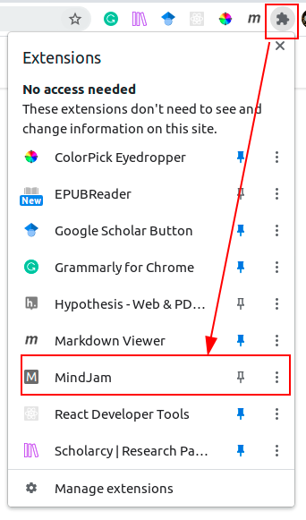
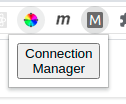
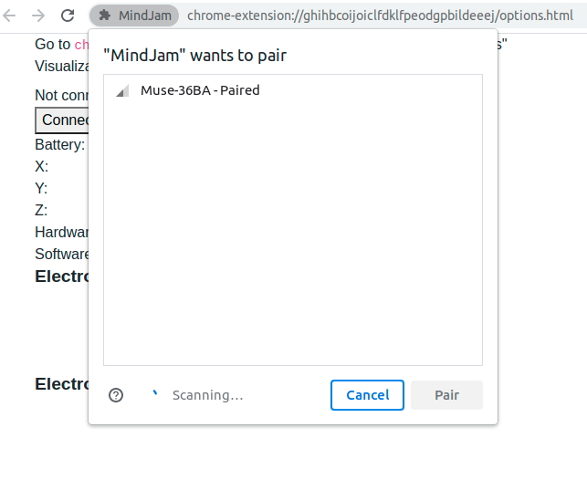
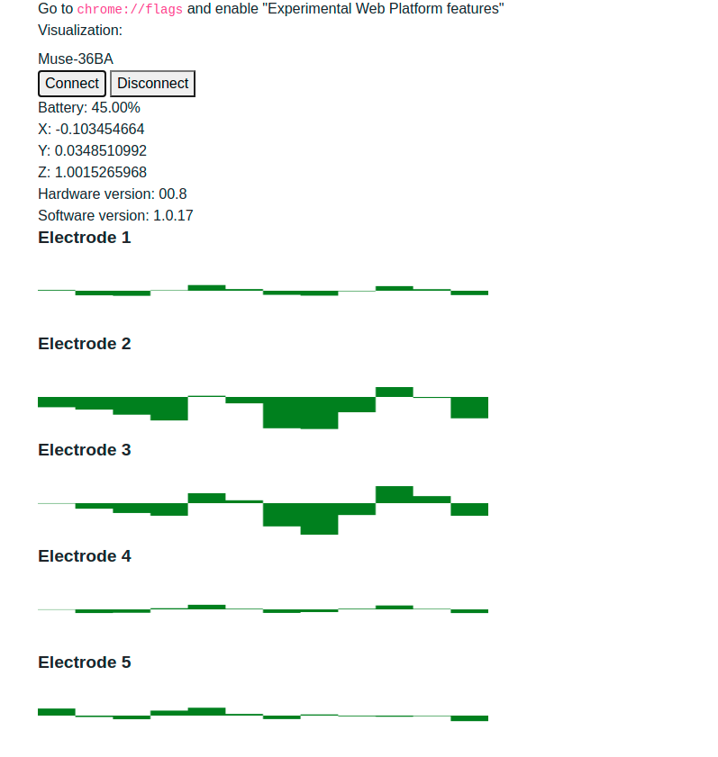

# MindJam

Jamming through Muse headbands!

This project is a bootstrap code to develop [muse-js](https://github.com/urish/muse-js) as a Chrome extension.

Since it is a Chrome extension, it is possible to connect to a Muse device while browsing other websites as we track the user's brainwaves as they browse. Potential use cases include therapies and market research, and it might be possible to use Muse to let user controls UI of certain websites. The possibilities are endless.

Note: The settings page is a similar demo page to the one in the **muse-js** module. I simply copied most of the code there.

## Installation

1. Go to `chrome://extensions`
2. Click on "Load unpacked"
3. Choose the MindJam directory.
4. Go to `chrome://flags`
5. Enable "Experimental Web Platform features"

## Usage

1. Click on the "Extensions" link, then "MindJam".
  
2. Click on "Connection Manager".
  
3. The extension settings page will show up in a new tab. From there, click on "Connect"
  and then choose the Muse 2 device.
  
4. The page will show the results similar to the demo from the [muse-js](https://github.com/urish/muse-js) module.
  

## Development

Before everything else, run the following command to install required modules:

```
npm install
```

MindJam uses `browserify` and `watchify` node modules to update and track node code into javascripts. Install them globally in your computer with the following commands:

```
npm install -g browserify watchify
```

Prior to developing the code, run the following code:

```
watchify includes/main.js -o includes/bundle.js -v
```

Any update to `main.js` will be merged with any imported modules over to `bundle.js`. Once the `bundle.js` is ready for production, run the following code to minify and obscure the code:

```
browserify includes/main.js | uglifyjs > includes/bundle.js
```
